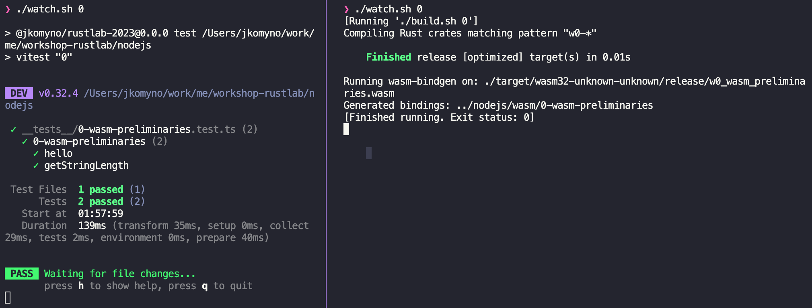

# Workshop: Production-ready WebAssembly with Rust

A workshop on Rust for WebAssembly by Alberto Schiabel ([@jkomyno](https://twitter.com/jkomyno)). 🤓
This workshop was first presented at [RustLab 2023](https://rustlab.it/talks/production-ready-webassembly-with-rust) in Florence, Italy.

The goal of this workshop is allowing experienced Rust engineers to develop WebAssembly modules that can be seamlessly integrated with Node.js and TypeScript codebases. No previous knowledge of WebAssembly is required.

We will be coding through a series of tutorials and test-driven exercises covering topics that every [WebAssembly](https://webassembly.org/) developer likely encounters in production settings:
- understanding [`wasm_bindgen`](https://github.com/rustwasm/wasm-bindgen), its uses, limitations, and alternatives
- error management and panic handling

Along the way, we'll point out some edge cases that will hopefully help you avoid hours of head-scratching and debugging sessions 😄.

We'll also hint at ways you can overcome WebAssembly's own limitations, proving that you can actually run I/O logic without needing [WASI](https://wasi.dev/).

Finally, we'll demonstrate how to port a moderately complex Rust library to WebAssembly, applying the concepts learnt during the workshop.

## Prerequisites

Before diving into the workshop, let's make sure you have the following tools installed in your system:

- A bash-compatible shell (if you use Windows you can [install bash](https://www.windowscentral.com/how-install-bash-shell-command-line-windows-10) or use Docker, as [described below](#using-docker))
- [Rust](https://www.rust-lang.org/tools/install) (tested on v`1.73.0`)
  - [`wasm32-unknown-unknown`](https://rustwasm.github.io/docs/book/reference/add-wasm-support-to-crate.html#maintaining-ongoing-support-for-webassembly) compilation target support:
    ```sh
    rustup target add wasm32-unknown-unknown
    ```
  - [`wasm_bindgen`](https://github.com/rustwasm/wasm-bindgen):
    ```sh
    cargo install -f wasm-bindgen-cli --version 0.2.88
    ```
  - [`cargo watch`](https://crates.io/crates/cargo-watch):
    ```sh
    cargo install cargo-watch
    ```
- [Node.js](https://nodejs.org/en/download) (tested on v`20.9.0`) 
  - [`pnpm`](https://pnpm.io/installation) (tested on v`8.9.2`)
    ```sh
    npm install -g pnpm
    ```
- A text editor of your choice (I recommend [Visual Studio Code](https://code.visualstudio.com/))

Optionally, you can also install the Wasm binary tools from [`bynarien`](https://github.com/WebAssembly/binaryen).
They are not strictly required for the workshop, but they can be useful to inspect the generated WebAssembly modules. 
If you [use Docker](#using-docker), you'll find these tools (e.g., `wasm2wat` and `wasm-opt`) already installed.

## Getting started

Clone the repository and run [`./install.sh`](./install.sh) to get all the necessary dependencies.
This workshop is divided into chapters, containing a mixture of lessons and exercises.

The first chapter is [`1-wasm-preliminaries`](./rust/README.md),

Each chapter focuses on a specific concept about WebAssembly development, and provides some examples and exercises to familiarize with that concept. For each chapter, you will need to complete some Rust code.

To test the exercises, open two terminal tabs side-by-side:
- one opened in the [`./nodejs`](./nodejs) folder
- the other opened in [`./rust`](./rust).

Run `./watch.sh` in each tab, followed by the chapter number.
For instance, for the first chapter, if you run `./watch.sh 2` in each tab,



the Rust code will silently be re-compiled to WebAssembly for you via `cargo watch`, and tested on Node.js via `vitest`.

The Rust source code in [`./rust`](./rust) uses [Cargo workspaces](https://doc.rust-lang.org/book/ch14-03-cargo-workspaces.html). This enables sharing dependencies across the exercise crates for each chapter via the `[workspace.dependencies]` attribute in [`./rust/Cargo.toml`](./rust/Cargo.toml): rather than having to add a specific version of a dependency in an exercise crate, we can refer to the workspace version instead.

```toml
# Cargo.toml in an exercise crate
[dependencies]
wasm-bindgen.workspace = true  # <- wasm-bindgen = "0.2.88"
```

Should run into any issue with the repository and the assumed level of knowledge, please raise your hand and ping us, so we can sort this through together 🪄.
Enjoy!

[➡️ GET STARTED](0-wasm-preliminaries/README.md).

## Using Docker

If you prefer to keep your environment clean and use Docker, you have two choices:
- If you use VSCode, you can re-open this repository in a DevContainer by running the `Dev Containers: Reopen in Container` command (you can open the command palette via `Ctrl+⇧+P` / `Cmd+⇧+P`).
- Otherwise, you can spin up a workable environment in your terminal via:

```bash
docker compose run --build --rm -it workspace
```

## Chapters overview

- ➡️ [`1-wasm-preliminaries`](./rust/README.md)
- ➡️ [`2-wasm-bindgen-types`](./rust/exercises/2-wasm-bindgen-types/README.md)
- ➡️ [`3-wasm-bindgen-classes`](./rust/exercises/3-wasm-bindgen-classes/README.md)
- ➡️ [`4-tsify-types`](./rust/exercises/4-tsify-types/README.md)
- ➡️ [`5-panic-handling`](./rust/exercises/5-panic-handling/README.md)
- ➡️ [`6-error-handling`](./rust/exercises/6-error-handling/README.md)
- ➡️ Demo

This is a work in progress, so stay tuned for more chapters about:
- `async / await` support
- online WebAssembly debugging on Chrome Dev Tools with source maps and breakpoints
- `WASI` support on Node.js
- Publish WebAssembly modules on [`npm`](https://www.npmjs.com/)
- and more!

## License

Licensed under [MIT License](LICENSE). © Alberto Schiabel.
